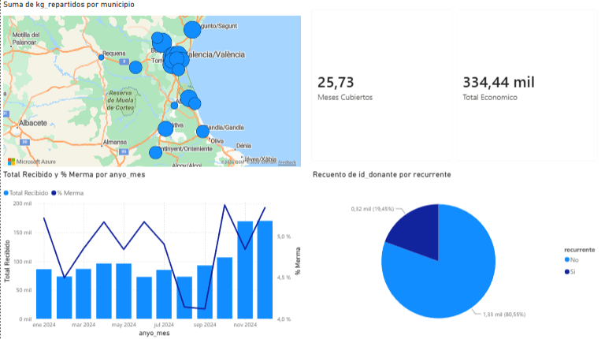
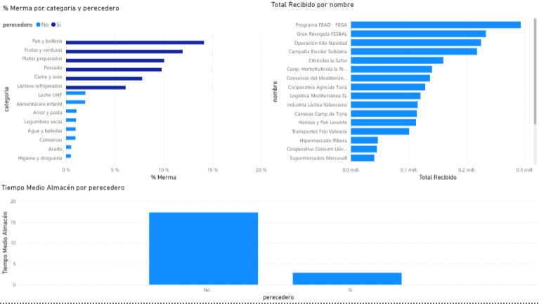

# BdA Valencia Analytics — Auditoría de almacén con SQL y Power BI

Análisis de la operativa de un banco de alimentos: entradas de producto, mermas, repartos a entidades y donaciones económicas. Proyecto de práctica en SQL y Power BI.

> **Sobre los datos:** el dataset es **sintético**: lo creé yo con datos ficticios (periodo 2024–2025) para simular la operativa real. Está inspirado en la operativa del Banco de Alimentos de Valencia que conocí en un proyecto de 180 Degrees Consulting, pero **no contiene datos reales** de la entidad ni de sus donantes.

---

## Preguntas de negocio

1. ¿Cuántos kilos entran, se pierden y se reparten cada mes, y cuál es el balance del almacén?
2. ¿Qué categorías de alimentos tienen más merma y requieren atención?
3. ¿Qué entidades reciben más producto perecedero?
4. ¿Cuántos euros en donaciones entran por cada kilo de alimento recibido?
5. ¿Cómo se distribuyen las entidades beneficiarias según su tamaño?
6. ¿Cubren las donaciones económicas los gastos fijos mensuales (13.000 €)?

## Modelo de datos (esquema en estrella)

| Tipo | Tabla | Contenido |
| --- | --- | --- |
| Hechos | `fact_entradas` | 7.200 entradas: kg recibidos, merma y aprovechados, motivo |
| Hechos | `fact_repartos` | 12.500 repartos: kg repartidos, entidad, días en almacén |
| Hechos | `fact_donaciones_eco` | 1.645 donaciones económicas: importe, tipo, recurrencia |
| Dimensión | `dim_alimento` | 14 categorías, perecedero, vida útil |
| Dimensión | `dim_entidad` | 60 entidades beneficiarias, municipio, personas atendidas |
| Dimensión | `dim_donante` | 22 donantes, tipo, recurrencia |
| Dimensión | `dim_calendario` | 731 días con año, mes, trimestre y campaña de Navidad |

## Contenido del repositorio

```text
bda-valencia-analytics/
├── data/
│   ├── BdA_Valencia_dataset.xlsx   # Dataset original (una hoja por tabla)
│   └── bda_valencia.db             # Base de datos SQLite con las 7 tablas
├── sql/                            # Consultas de análisis
├── powerbi/
│   └── BdA_Dashboard.pbix          # Dashboard de Power BI
└── capturas/                       # Capturas del dashboard
```

## Consultas SQL

| Archivo | Pregunta que responde | Técnicas |
| --- | --- | --- |
| `01_balance_mensual_almacen.sql` | Kg recibidos, merma, aprovechados, repartidos y balance por mes | CTEs, agregación previa a la unión para no duplicar kilos, `LEFT JOIN`, `COALESCE` |
| `02_semaforo_mermas_categorias.sql` | Semáforo de merma por categoría (Óptimo / Atención / Alerta crítica) | CTE, `CASE` con umbrales del 5 % y el 10 % |
| `03_auditoria_entidades_perecederos.sql` | Entidades con más de 3.000 kg de perecederos recibidos | `JOIN` de tres tablas, `HAVING` |
| `04_ratio_financiero_euros_kilo.sql` | Euros donados por kilo recibido, por mes | Dos CTEs y unión por mes |
| `05_clasificacion_tamaño_entidades.sql` | Entidades por tramo de tamaño y media de personas atendidas | `CASE`, `GROUP BY`, `AVG` |

## Dashboard de Power BI

Dos páginas, con medidas DAX propias (`Total Recibido`, `% Merma`, `Total Económico`, `Meses Cubiertos`, `Tiempo Medio Almacén`).

**Resumen operativo:** kilos repartidos por municipio en mapa, total de donaciones económicas y meses de gastos fijos que cubren, evolución mensual de kilos recibidos y % de merma, y peso de las donaciones recurrentes.



**Mermas y logística:** % de merma por categoría (perecedero o no), kilos recibidos por donante y tiempo medio en almacén.



## Principales resultados (sobre el dataset sintético)

- Merma global del **4,9 %** de los kilos recibidos.
- **3 categorías en alerta crítica** (pan y bollería, frutas y verduras, platos preparados) y **3 en atención** (pescado, carne y aves, lácteos refrigerados): todas perecederas.
- Tiempo medio en almacén de **11,1 días**: los perecederos salen en unos 3 días y los no perecederos tardan unos 17.
- Las donaciones económicas suman de media **13.935 €/mes**, pero solo **10 de los 24 meses** superan los 13.000 € de gastos fijos: los ingresos son muy estacionales.
- De 60 entidades, 4 son grandes (≥ 500 personas), 20 medianas y 36 pequeñas.

## Cómo reproducirlo

1. Abre `data/bda_valencia.db` con [DB Browser for SQLite](https://sqlitebrowser.org/) y ejecuta cualquier consulta de `sql/`.
2. Abre `powerbi/BdA_Dashboard.pbix` con Power BI Desktop.

## Herramientas

SQL (SQLite) · Power BI (DAX) · Excel
